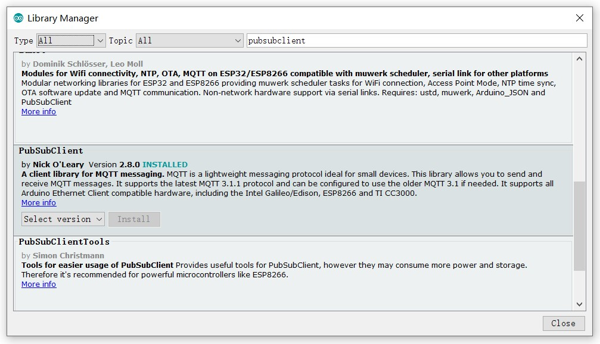
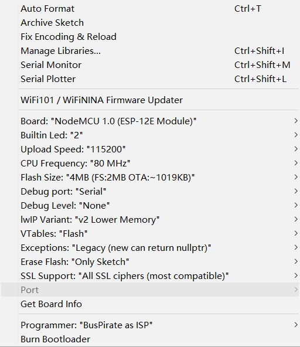

# auto-battery-charge-for-linux-deploy-using-esp8266
an auto switch for battery charge based on arduino and mqtt  
## Control Mode
- **Disconnect mode**  when wifi is not connected
- **Auto Control mode 1**  when mqtt broker is inaccessiable
- **Auto Control mode 2**   when mqtt publisher is inaccessiable
- **ChargeMode** when everything is right
## Quick Start
### for esp8266
* **configure esp support to arduino**  
    File > Preference > Settings > Additional Boards Manager URLs -> http://arduino.esp8266.com/stable/package_esp8266com_index.json  
* **add mqtt library**  
    Tools > Manage Libraries > search "PubSubClient" and Install  
  
* **import code and update variables**  
    ssid -> your wifi ssid  
    password -> your wifi password  
    mqtt-server -> your mqtt server ip  
    mqtt-port -> mqtt server listen port  
    [user_name / user_password] optional if your mqtt server don't use password  
* **upload to hardware**  
    Tools > Board > choose suitable hardware > don't forget choose port  

### for linux deploy
* **install mqtt library**  
```
pip3 install paho-mqtt
```
* **import code and update variables**  
    strBroker -> "mqtt server ip"  
    port -> mqtt server port  
    username -> "mqtt-username" [optional]  
    password -> "mqtt-password" [optional]   

    update your battery status and capacity path, it might be similar to   
```
/sys/class/power_supply/Battery/status
/sys/class/power_supply/Battery/capacity
```
* **Run mosquitto (recommand on vps)**
```
mosquitto -c /etc/mosquitto/mosquitto.conf
```
* **Run batteryd**
```
python3 batteryd.py
```
* **auto run batteryd**  
    enable run parts > rc.local in linux deploy  
    add those to `/etc/rc.local`  
```
#!/bin/sh -e
# mosquitto
# mosquitto -c /etc/mosquitto/mosquitto.conf -d

# batteryd
python3 /path/to/batteryd.py > /path/to/logs/batteryd.log &
```
***
## ps
How to make phone auto boot when charge (Android 5+)? [link](https://www.jianshu.com/p/391905516d63)  
How to change linux deploy image size? [link](https://github.com/meefik/linuxdeploy/issues/395#issuecomment-177507622)
